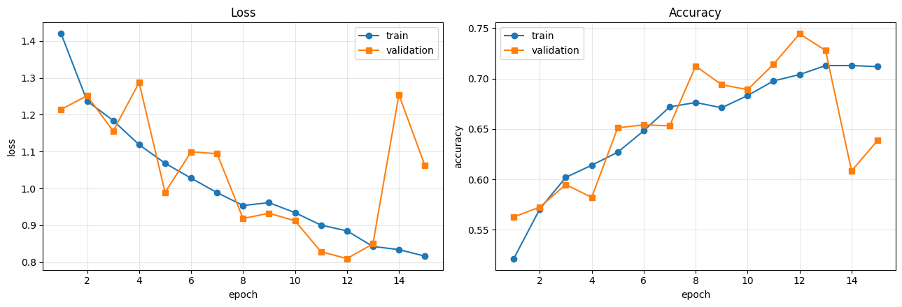
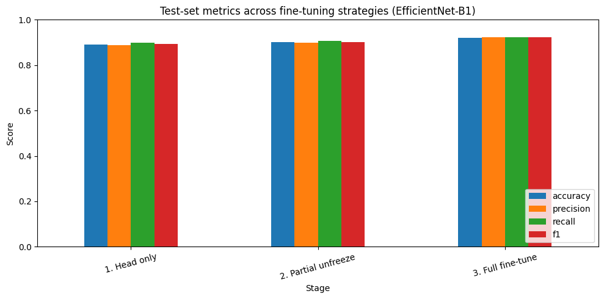
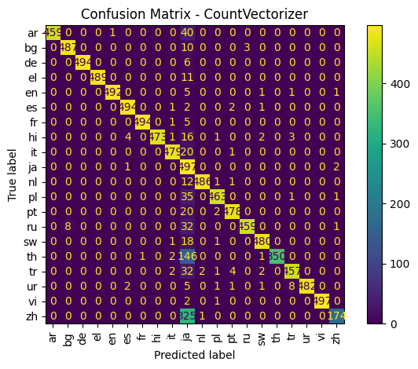
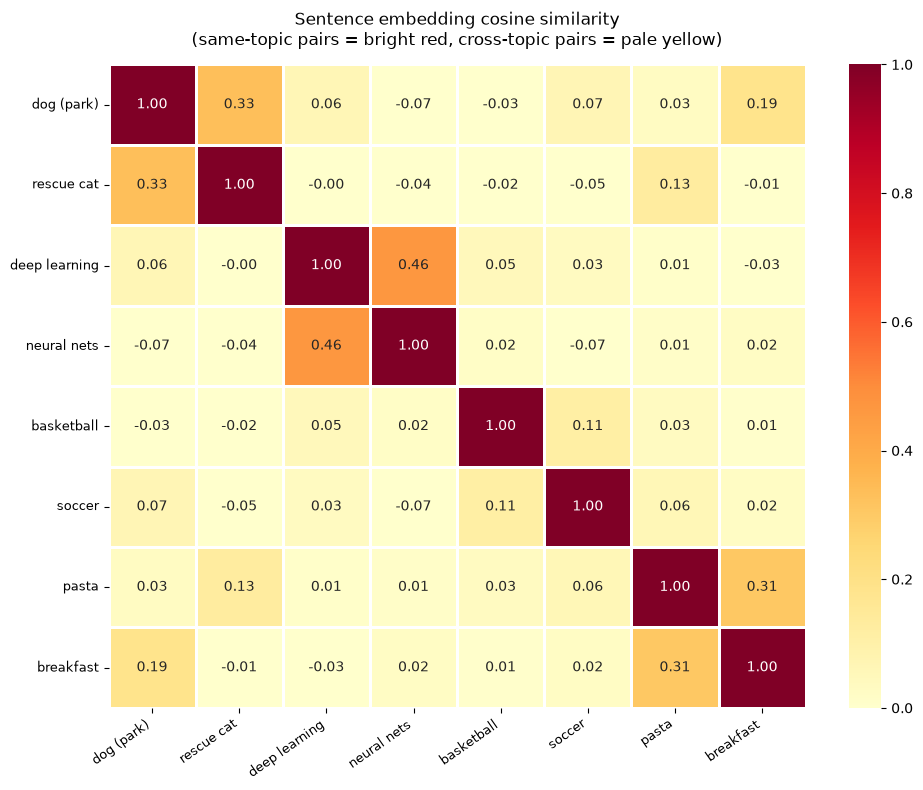
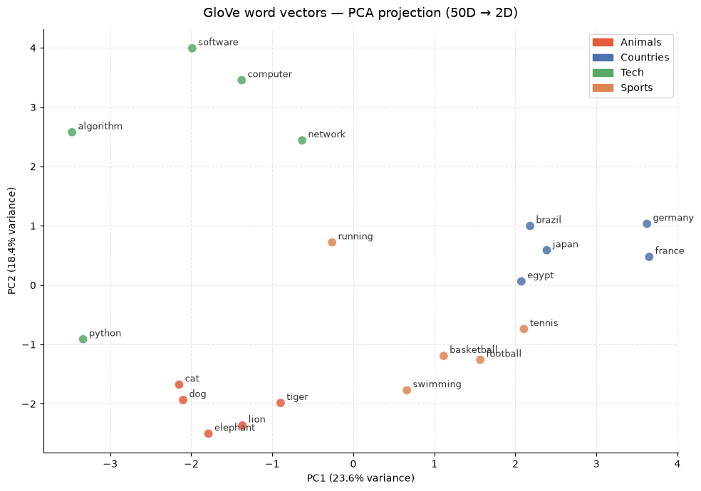
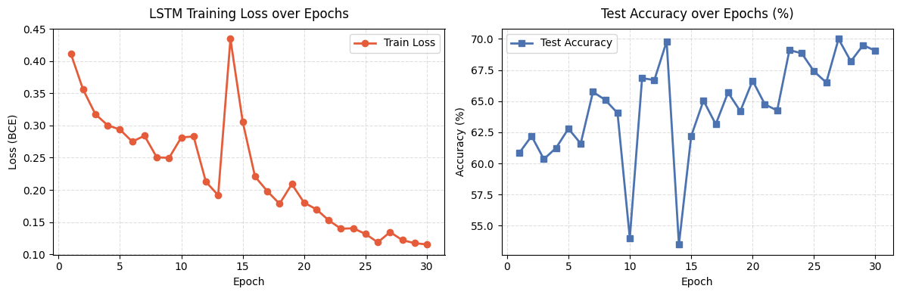
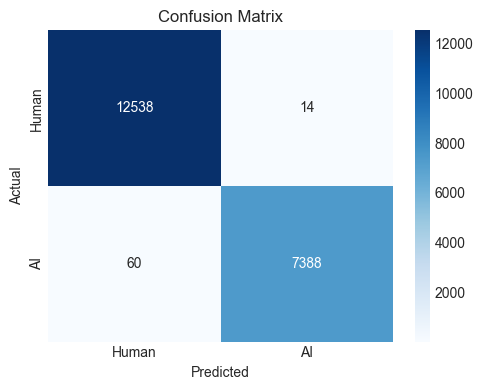
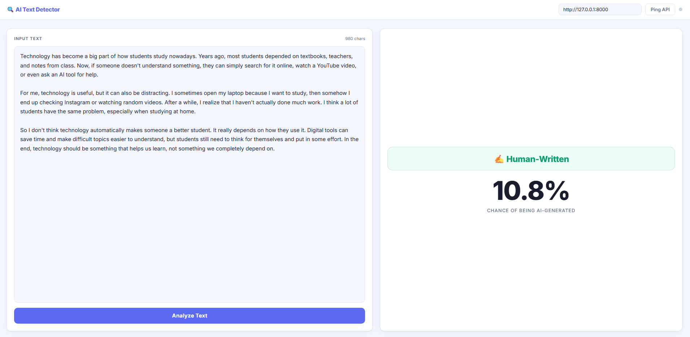

# ITI Summer Camp 2026 — Applied AI & Generative AI

> **Comprehensive hands-on training archive in Applied Python, Computer Vision, Natural Language Processing (NLP), Large Language Models (LLMs), Agentic AI, Retrieval-Augmented Generation (RAG), and Deep Learning.**

---

## 📌 Overview

This repository documents my complete technical journey and coursework completed during the **Information Technology Institute (ITI) Summer Camp 2026**. 

The program provided intensive, hands-on training across foundational and modern applied artificial intelligence domains—progressing systematically from core Python programming and data structures to Deep Learning, Computer Vision, Pretrained Transformers, Prompt Engineering, Agentic AI with LangChain, and full-stack AI application deployment.

Every module in this repository is structured into documented lecture material, guided laboratory implementations, graded assignments, course projects, and references to the final capstone project.

---

## 🗓️ Training Schedule & Timeline

The official training schedule followed a rigorous hands-on curriculum:

| Date | Topic / Module | Instructor | Focus Areas |
| :--- | :--- | :--- | :--- |
| **09-Aug-2026** | Python for Applied AI (Part 1) | **Ahmed Gamal** | Advanced OOP, Classes, Dunder Methods, Custom Data Structures |
| **10-Aug-2026** | Python for Applied AI (Part 2) | **Ahmed Gamal** | Vectorized NumPy, Type Hinting, Context Managers, Custom Modules |
| **12-Aug-2026** | Computer Vision & Pretrained Models (Part 1) | **Mahmoud Sayed Abdein** | Image Preprocessing, Convolutions, PyTorch CNN Architectures |
| **13-Aug-2026** | Computer Vision & Pretrained Models (Part 2) | **Mahmoud Sayed Abdein** | Transfer Learning, Feature Extraction, Fine-tuning (MobileNet, EfficientNet) |
| **14-Aug-2026** | YOLO & CV Applications (Part 1) | **Mahmoud Sayed Abdein** | Object Detection Concepts, Model Architectures, Bounding Boxes |
| **15-Aug-2026** | YOLO & CV Applications (Part 2) | **Mahmoud Sayed Abdein** | Practical Vision Pipelines & Machine Learning Foundations |
| **17-Aug-2026** | NLP Concepts (Part 1) | **Muhammed Bassiouni** | Regular Expressions, String Distance Algorithms (Levenshtein, Jaro-Winkler) |
| **18-Aug-2026** | NLP Concepts (Part 2) | **Muhammed Bassiouni** | Text Normalization, Lemmatization, Stemming, Bag-of-Words, TF-IDF |
| **19-Aug-2026** | NLP Concepts (Part 3) | **Muhammed Bassiouni** | Multilingual Language Identification, Classification Pipelines |
| **20-Aug-2026** | NLP Applications | **Muhammed Bassiouni** | Tokenization (BPE, WordPiece, Tiktoken), Word Embeddings (Word2Vec) |
| **21-Aug-2026** | LLMs & Generative AI (Part 1) | **Basil Reda** | Transformer Architecture, Self-Attention, LLM Foundations |
| **22-Aug-2026** | LLMs & Generative AI (Part 2) | **Basil Reda** | System Prompt Engineering, Few-Shot Prompting, Output Structuring |
| **25-Aug-2026** | RAG Fundamentals (Part 1) | **Muhammed Bassiouni** | Retrieval-Augmented Generation, Chunking Strategies, Vector Stores |
| **26-Aug-2026** | RAG Fundamentals (Part 2) | **Muhammed Bassiouni** | Context Injection, Hybrid Search, Evaluation of RAG Pipelines |
| **29-Aug - 02-Sep** | Final Capstone Project Work | *Project Phase* | Development of **Tamargi Pharma RAG** |
| **03-Sep-2026** | Final Project Demo & Defense | *Evaluation* | Presentation, Live Demonstration & Technical Review |

---

## 👨‍🏫 Instructors & Acknowledgements

Special appreciation and sincere thanks to the instructors whose mentorship, industry expertise, and practical guidance made this training experience possible:

- **Ahmed Gamal** — *Instructor for Python for Applied AI*  
  Thank you for establishing deep foundational concepts in modern Python, object-oriented design, vectorized computation with NumPy, and production-grade coding habits.
- **Mahmoud Sayed Abdein** — *Instructor for Computer Vision, Pretrained Models, and YOLO*  
  Thank you for the rigorous coverage of Convolutional Neural Networks, transfer learning strategies, fine-tuning pretrained vision backbones, and computer vision workflows.
- **Muhammed Bassiouni** — *Instructor for NLP Concepts, NLP Applications, and RAG Fundamentals*  
  Thank you for building our Natural Language Processing foundations from algorithmic text manipulation to dense vector embeddings, sequence models, and Retrieval-Augmented Generation.
- **Basil Reda** — *Instructor for LLMs and Generative AI*  
  Thank you for introducing modern Generative AI paradigms, Transformer architectures, and system prompt engineering techniques.

> **Institutional Acknowledgment**: Special thanks to the **Information Technology Institute (ITI)** for organizing this comprehensive program and providing an exceptional environment for practical learning in Applied Artificial Intelligence.

---

## 📚 Learning Modules

```
ITI-Summer-Camp-2026/
├── 01-python-applied-ai/      # OOP, NumPy, Context Managers, Modules, Lab Practicals
├── 02-computer-vision/        # CNNs, MobileNetV2, EfficientNetB1 Transfer Learning, ML Labs
├── 03-nlp/                    # Regex, Distance, TF-IDF, BPE, Embeddings, PyTorch Sequence Models, Prompting
├── 04-agentic-ai/             # Agentic AI with LangChain, Tool-Calling, Web Search Agents
├── 05-rag/                    # Retrieval-Augmented Generation Foundations & Practicals
├── 06-deep-learning/          # Deep Learning Fundamentals & Keras Neural Networks
├── 07-projects/               # AI Generated Text Detector (FastAPI Backend + Modern Frontend)
└── assets/                    # Visual Results and Extracted Training Artifacts
```

### 1. Python for Applied AI
- **Topics**: Advanced Object-Oriented Programming (dunder methods, operator overloading, encapsulation, polymorphism), Vectorized computing with NumPy, Type Hints (`typing`), Context Managers (`__enter__` / `__exit__`), and custom module structuring.
- **Key Notebooks**:
  - [Day 1 OOP Lecture Notebook](./01-python-applied-ai/day-01/Day%201%20-%20OOP%20-%20Lecture%20Notebook.ipynb)
  - [Day 1 Lab Solutions](./01-python-applied-ai/day-01/Day%201%20Lab/Day%201%20Lab%20Answers.ipynb)
  - [Day 2 NumPy & Vectorization](./01-python-applied-ai/day-02/Day%202%20-%20Numpy.ipynb)
  - [Day 2 Type Hints & Context Managers](./01-python-applied-ai/day-02/Day%202%20-%20Type%20hints%20-%20Modules%20-%20Context%20Managers.ipynb)
  - [Day 2 Lab Solutions](./01-python-applied-ai/day-02/Day%202%20Lab/Lab%20Answers.ipynb)

### 2. Computer Vision & Pretrained Models
- **Topics**: Image processing, PyTorch convolutional layers, pooling, data augmentation transforms, multi-stage transfer learning (feature extraction vs. partial fine-tuning vs. full fine-tuning), and vision backbones (MobileNetV2, EfficientNetB1).
- **Key Notebooks**:
  - [PyTorch CNNs & CIFAR-10 Classification](./02-computer-vision/pretrained-models/day-03/cv-cnns.ipynb)
  - [Computer Vision Task 1 Assignment](./02-computer-vision/pretrained-models/day-03/Assignment/cv-and-pretrained-models-task-1.ipynb)
  - [Transfer Learning Lecture & Exercises](./02-computer-vision/pretrained-models/day-04/computer-vision-pretrained-models-lecture2-exercise.ipynb)
  - [EfficientNetB1 Multi-Stage Transfer Learning Assignment](./02-computer-vision/pretrained-models/day-04/Assignment%202/assignment2-transferlearning-efficientnetb1-answer.ipynb)
  - [CIFAR-10 CNN Image Classification](./02-computer-vision/yolo-object-detection/Assignment/cifar10-cnn-image-classification-ipynb.ipynb)

### 3. Natural Language Processing (NLP) & Sequence Models
- **Topics**: Regular expressions pattern matching, string distance metrics (Levenshtein, Damerau-Levenshtein, Jaro-Winkler via Jellyfish), text normalization (stemming, lemmatization), TF-IDF feature matrices, Byte-Pair Encoding (BPE with `tiktoken`), dense semantic embeddings (`gensim` Word2Vec, cosine similarity matrices, 2D PCA/t-SNE visualization), and PyTorch Sequence Models (`nn.Embedding`, `nn.GRU`/`nn.LSTM`, custom training loops).
- **Key Notebooks**:
  - [Regex Fundamentals](./03-nlp/nlp-concepts/day-06/Material/01_01_regex.ipynb)
  - [Edit Distances & Similarity](./03-nlp/nlp-concepts/day-06/Material/01_02_edit_distances.ipynb)
  - [Text Normalization](./03-nlp/nlp-concepts/day-06/Material/01_03_text_normalization.ipynb)
  - [Feature Extraction & TF-IDF](./03-nlp/nlp-concepts/day-06/Material/01_04_feature_extraction.ipynb)
  - [Multilingual Language Detection Assignment](./03-nlp/nlp-concepts/day-06/Assignments/Copy_of_Assignment1_Language_Detection.ipynb)
  - [Tokenization & BPE](./03-nlp/nlp-concepts/day-07/Material/02_01_tokenization.ipynb)
  - [Embeddings & Vector Space Projections](./03-nlp/nlp-concepts/day-07/Material/02_02_embeddings.ipynb)
  - [PyTorch Sequence Models for Text Classification](./03-nlp/nlp-concepts/day-07/Material/02_03_sequence_models.ipynb)
  - [Spotify Reviews Rating Classification Assignment](./03-nlp/nlp-concepts/day-07/Assignment/Assignment2_Spotify_Reviews_Rating.ipynb)

### 4. LLMs & System Prompt Engineering
- **Topics**: Transformer foundations, prompt design patterns, role definition, chain-of-thought prompting, schema constraints, and LLM orchestration with `langchain-google-genai`.
- **Key Material & Notebooks**:
  - [LLM Architecture Presentation Deck](./03-nlp/llms-generative-ai/day-08/LLM_architecture_presentation_deck.pptx)
  - [System Prompt Engineering Practical Notebook](./03-nlp/llms-generative-ai/day-08/Lab/System_Prompt_Engineering_Practical_STUDENT.ipynb)

### 5. Agentic AI & Tool-Use Workflows
- **Topics**: Autonomous reasoning agents, LangChain agent executors, custom tool definitions, web search grounding with DuckDuckGo Search (`ddgs`), structured tool binding, and multi-step question answering.
- **Key Notebooks**:
  - [Agentic AI Practical Notebook](./04-agentic-ai/day-09/Agentic_AI_LangChain.ipynb)
  - [Agentic AI Reference Solutions](./04-agentic-ai/day-09/Agentic_AI_LangChain_Answers.ipynb)
  - [Agentic AI Presentation Deck](./04-agentic-ai/day-09/Agentic_AI.pptx)

### 6. Retrieval-Augmented Generation (RAG)
- **Topics**: Retrieval-augmented LLM architectures, dense vector retrieval, context augmentation, and prompt routing.
- **Key Notebooks**:
  - [RAG Fundamentals Practical Notebook](./05-rag/rag-fundamentals/day-10/System_Prompt_Engineering_Practical_STUDENT.ipynb)

### 7. Deep Learning Fundamentals
- **Topics**: Multi-Layer Perceptrons, Keras Sequential API, activation functions, loss functions, optimizers, and training callbacks.
- **Key Notebooks**:
  - [Keras Deep Learning Foundations](./06-deep-learning/kaggle-course/1-Keras.ipynb)

---

## 📊 Training Highlights & Visual Results

Real visual outputs and metrics extracted directly from the training notebooks:

### 1. Computer Vision: CNN Training & Convergence
Validation accuracy and loss dynamics across training epochs on CIFAR-10 image classification.
- **Notebook**: [`cv-cnns.ipynb`](./02-computer-vision/pretrained-models/day-03/cv-cnns.ipynb)



---

### 2. Multi-Stage Transfer Learning: EfficientNetB1
Comparison of classification performance across 3 transfer learning phases: Feature Extraction (Head only) vs. Partial Fine-Tuning vs. Full Fine-Tuning.
- **Notebook**: [`assignment2-transferlearning-efficientnetb1-answer.ipynb`](./02-computer-vision/pretrained-models/day-04/Assignment%202/assignment2-transferlearning-efficientnetb1-answer.ipynb)



---

### 3. Natural Language Processing: Multilingual Language Detection
Evaluation confusion matrix for multilingual classification pipeline distinguishing languages from raw text snippets.
- **Notebook**: [`Copy_of_Assignment1_Language_Detection.ipynb`](./03-nlp/nlp-concepts/day-06/Assignments/Copy_of_Assignment1_Language_Detection.ipynb)



---

### 4. Dense Semantic Embeddings: Cosine Similarity Matrix
Heatmap illustrating pairwise cosine similarity between semantic vector representations of words and concept clusters.
- **Notebook**: [`02_02_embeddings.ipynb`](./03-nlp/nlp-concepts/day-07/Material/02_02_embeddings.ipynb)



---

### 5. Semantic Vector Space: 2D PCA Projection
Dimensionality reduction projecting 50-dimensional dense word embeddings into 2D space to visualize semantic relationships.
- **Notebook**: [`02_02_embeddings.ipynb`](./03-nlp/nlp-concepts/day-07/Material/02_02_embeddings.ipynb)



---

### 6. Deep NLP: PyTorch Sequence Model Convergence
Training and validation loss progression for custom PyTorch sequence model classifying text sentiment.
- **Notebook**: [`02_03_sequence_models.ipynb`](./03-nlp/nlp-concepts/day-07/Material/02_03_sequence_models.ipynb)



---

## 🏆 Final Capstone Project: Tamargi Pharma RAG

The official graduation capstone project developed at the conclusion of the ITI Summer Camp 2026 is **Tamargi Pharma RAG**, hosted in its dedicated standalone repository:

🔗 **Project Repository**: [https://github.com/MohameddTamerr/tamargi-pharma-rag](https://github.com/MohameddTamerr/tamargi-pharma-rag)

### About Tamargi Pharma RAG
- **Domain**: Pharmaceutical and Clinical Information Retrieval & Question-Answering.
- **Core Architecture**: Advanced Retrieval-Augmented Generation (RAG) system utilizing vector databases, embedding pipelines, semantic search, and grounded LLM generation.
- **Features**: Accurate drug interaction lookup, medication queries, dosage guidance, and context-backed pharmaceutical insights.

---

## 🚀 Module Project: AI Generated Text Detector

In addition to the final capstone, the NLP module includes an end-to-end **AI Generated Text Detector** application that classifies text as **Human-Written** or **AI-Generated**.

- **Project Location**: [`07-projects/nlp-project/`](./07-projects/nlp-project/)
- **Project Presentation**: [Project AI Generated Text Detector.pdf](./07-projects/nlp-project/Project%20AI%20Generated%20Text%20Detector.pdf)
- **Training Pipeline**: [`train_model.py`](./07-projects/nlp-project/train_model.py)
- **Interactive Notebook**: [`AI_Text_Detector.ipynb`](./07-projects/nlp-project/AI_Text_Detector.ipynb)
- **Backend API**: [`main.py`](./07-projects/nlp-project/main.py) (FastAPI REST service)
- **Frontend Client**: [`index.html`](./07-projects/nlp-project/index.html), [`style.css`](./07-projects/nlp-project/style.css), [`app.js`](./07-projects/nlp-project/app.js)

### System Architecture & Pipeline
1. **Data Preprocessing & Feature Engineering**: Text cleaning, lowercasing, stopword removal, and TF-IDF vectorization with n-gram feature extraction.
2. **Model Training & Evaluation**: Supervised classification evaluated via precision, recall, F1-score, and confusion matrix.
3. **Model Serialization**: Exported pipeline saved to `models/ai_text_classifier.joblib`.
4. **FastAPI Web Service**: High-throughput REST API endpoint `/predict` serving real-time inferences with prediction confidence scores.
5. **Modern Web UI**: Responsive single-page interface with real-time text analysis, probability gauges, and instant classification output.

### Project Evaluation & Live Interface
| Evaluation Confusion Matrix | Live Web Application UI |
| :---: | :---: |
|  |  |

---

## 🛠️ Technologies & Skills

| Category | Technologies & Tools |
| :--- | :--- |
| **Programming Languages** | Python 3.10+, JavaScript (ES6+), HTML5, CSS3 |
| **Deep Learning & CV** | PyTorch, TorchVision, TensorFlow, Keras, OpenCV, PIL |
| **NLP & LLMs** | NLTK, Gensim (Word2Vec), Tiktoken (BPE), Sentence-Transformers, Jellyfish |
| **Generative & Agentic AI** | LangChain, LangChain-Google-GenAI, Prompt Engineering, DuckDuckGo Search |
| **Machine Learning & Data** | Scikit-Learn, NumPy, Pandas, SciPy, Joblib |
| **Data Visualization** | Matplotlib, Seaborn |
| **Web Services & API** | FastAPI, Uvicorn, Pydantic, REST APIs |
| **Development Environment** | Jupyter Notebook, JupyterLab, VS Code, Git/GitHub |

---

## 💻 How to Use & Run Locally

### 1. Clone the Repository
```bash
git clone https://github.com/MohameddTamerr/ITI_SummerCamp_2026.git
cd ITI_SummerCamp_2026
```

### 2. Create and Activate a Virtual Environment
```bash
# Windows
python -m venv .venv
.venv\Scripts\activate

# Linux / macOS
python3 -m venv .venv
source .venv/bin/activate
```

### 3. Install Dependencies
```bash
pip install -r requirements.txt
```

### 4. Launch Jupyter to Explore Notebooks
```bash
jupyter notebook
```

### 5. Run the AI Text Detector Web App
```bash
cd 07-projects/nlp-project
uvicorn main:app --reload --port 8000
```
Open `http://localhost:8000` or open `index.html` directly in your browser.

---

<br>

# النسخة العربية

---

# معسكر التدريب الصيفي لمعهد تكنولوجيا المعلومات 2026 — الذكاء الاصطناعي التطبيقي والتوليدي
### ITI Summer Camp 2026 — Applied AI & Generative AI

> **أرشيف توثيقي شامل وتطبيقي للتدريب العملي في بايثون التطبيقي، الرؤية الحاسوبية (Computer Vision)، معالجة اللغات الطبيعية (NLP)، النماذج اللغوية الكبيرة (LLMs)، الذكاء الاصطناعي الوكيل (Agentic AI)، ونظم التوليد المدعوم بالاسترجاع (RAG)، والتعلم العميق.**

---

## 📌 نظرة عامة

يحتوي هذا المستودع على توثيق شامل لجميع الأعمال والمشاريع والتطبيقات البرمجية التي تم إنجازها خلال **معسكر التدريب الصيفي لمعهد تكنولوجيا المعلومات (ITI) لعام 2026**.

شمل البرنامج تدريبًا عمليًا مكثفًا يغطي مسارات الذكاء الاصطناعي من الأساسيات البرمجية إلى أحدث التقنيات التوليدية والوكيلة:
- البرمجة المتقدمة بلغة بايثون والبرمجة كائنية التوجه (OOP) والحوسبة المصفوفية (NumPy).
- الرؤية الحاسوبية والشبكات العصبية الالتفافية (CNNs) ونقل التعلم (Transfer Learning) باستخدام نماذج مثل MobileNet و EfficientNet.
- معالجة اللغات الطبيعية وخوارزميات النصوص والترميز المتقدم (BPE) ونماذج التضمين الدلالي (Word Embeddings) ونماذج التسلسل (Sequence Models) في PyTorch.
- هندسة الأوامر (Prompt Engineering) والنماذج اللغوية الكبيرة (LLMs).
- الذكاء الاصطناعي الوكيل (Agentic AI) وبناء وكلاء قادرين على استدعاء الأدوات والبحث التلقائي باستخدام LangChain.
- أسس التوليد المدعوم بالاسترجاع (RAG).
- مشروع نهائي متكامل لتصنيف النصوص بالإضافة إلى مشروع التخرج الختامي للمعسكر.

---

## 🗓️ الجدول الزمني للتدريب

| التاريخ | الموضوع / المسار | المدرب | المحاور الرئيسية |
| :--- | :--- | :--- | :--- |
| **09-08-2026** | بايثون للذكاء الاصطناعي التطبيقي (1) | **أحمد جمال (Ahmed Gamal)** | البرمجة كائنية التوجه المتقدمة (OOP)، الفئات، الدوال الخاصة |
| **10-08-2026** | بايثون للذكاء الاصطناعي التطبيقي (2) | **أحمد جمال (Ahmed Gamal)** | مكتبة NumPy، التلميحات النوعية (Type Hints)، مدراء السياق، الوحدات |
| **12-08-2026** | الرؤية الحاسوبية والنماذج المدربة مسبقًا (1) | **محمود سيد عابدين (Mahmoud Sayed Abdein)** | معالجة الصور، الشبكات الالتفافية (CNNs) باستخدام PyTorch |
| **13-08-2026** | الرؤية الحاسوبية والنماذج المدربة مسبقًا (2) | **محمود سيد عابدين (Mahmoud Sayed Abdein)** | نقل التعلم (Transfer Learning)، استخراج الخصائص والضبط الدقيق |
| **14-08-2026** | كشف الكائنات وتطبيقات الرؤية الحاسوبية (1) | **محمود سيد عابدين (Mahmoud Sayed Abdein)** | مفاهيم كشف الأجسام وصناديق التحديد وتطبيقات الرؤية |
| **15-08-2026** | كشف الكائنات وتطبيقات الرؤية الحاسوبية (2) | **محمود سيد عابدين (Mahmoud Sayed Abdein)** | تطبيقات عملية وأسس التعلم الآلي للرؤية الحاسوبية |
| **17-08-2026** | مفاهيم معالجة اللغات الطبيعية (1) | **محمد بسيوني (Muhammed Bassiouni)** | التعبيرات النمطية (Regex)، مقاييس مسافات النصوص (Levenshtein) |
| **18-08-2026** | مفاهيم معالجة اللغات الطبيعية (2) | **محمد بسيوني (Muhammed Bassiouni)** | تسوية النصوص، إزالة الكلمات الشائعة، استخراج الميزات (TF-IDF) |
| **19-08-2026** | مفاهيم معالجة اللغات الطبيعية (3) | **محمد بسيوني (Muhammed Bassiouni)** | التعرف على اللغات المتعددة وتصنيف النصوص |
| **20-08-2026** | تطبيقات معالجة اللغات الطبيعية | **محمد بسيوني (Muhammed Bassiouni)** | تقنيات الترميز (BPE, Tiktoken)، التضمينات الدلالية (Word2Vec) |
| **21-08-2026** | النماذج اللغوية الكبيرة والذكاء الاصطناعي التوليدي (1) | **باسل رضا (Basil Reda)** | معمارية المحولات (Transformers)، الانتباه الذاتي، أسس LLMs |
| **22-08-2026** | النماذج اللغوية الكبيرة والذكاء الاصطناعي التوليدي (2) | **باسل رضا (Basil Reda)** | هندسة الأوامر (System Prompt Engineering)، النماذج التوليدية |
| **25-08-2026** | أساسيات الـ RAG (1) | **محمد بسيوني (Muhammed Bassiouni)** | التوليد المدعوم بالاسترجاع، تقسيم النصوص، قواعد البيانات الشعاعية |
| **26-08-2026** | أساسيات الـ RAG (2) | **محمد بسيوني (Muhammed Bassiouni)** | حقن السياق، البحث الهجين، تقييم منظومات الـ RAG |
| **29-08 إلى 02-09** | العمل على مشروع التخرج النهائي | *مرحلة المشروع* | تطوير مشروع **Tamargi Pharma RAG** |
| **03-09-2026** | العرض التقديمي والمناقشة | *التقييم النهائي* | استعراض ومناقشة المشروع النهائي |

---

## 👨‍🏫 المدربون والشكر والتقدير

نتقدم بخالص الشكر والتقدير للسادة المدربين على جهودهم القيمة ونقل خبراتهم العلمية والعملية طوال فترة التدريب:

- **م. أحمد جمال (Ahmed Gamal)** — *مدرب بايثون للذكاء الاصطناعي التطبيقي*  
  شكرًا جزيلاً على تأسيس المهارات البرمجية المتقدمة بلغة بايثون، والبرمجة كائنية التوجه، واستخدام NumPy للحوسبة الرياضية الفعالة.
- **م. محمود سيد عابدين (Mahmoud Sayed Abdein)** — *مدرب الرؤية الحاسوبية والنماذج المدربة مسبقًا وتطبيقات الكشف*  
  شكرًا جزيلاً على الشرح العملي للشبكات العصبية الالتفافية (CNNs)، وتقنيات نقل التعلم (Transfer Learning)، والضبط الدقيق لنماذج الرؤية.
- **م. محمد بسيوني (Muhammed Bassiouni)** — *مدرب معالجة اللغات الطبيعية وأساسيات الـ RAG*  
  شكرًا جزيلاً على التأسيس القوي في خوارزميات معالجة اللغات، والتضمين الدلالي، وبناء نماذج التسلسل، ومنظومات الاسترجاع والتوليد.
- **م. باسل رضا (Basil Reda)** — *مدرب النماذج اللغوية الكبيرة والذكاء الاصطناعي التوليدي*  
  شكرًا جزيلاً على تقديم المفاهيم الحديثة لمعمارية المحولات (Transformers) والتدريب العملي على هندسة الأوامر المتقدمة.

> **شكر خاص**: نتوجه بالشكر والتقدير لـ **معهد تكنولوجيا المعلومات (Information Technology Institute - ITI)** على تنظيم هذا البرنامج الصيفي المتميز وتوفير البيئة التعليمية والعملية لتطوير المهارات التقنية في مجال الذكاء الاصطناعي.

---

## 📂 محتوى التدريب والمسارات العملية

### 1. بايثون التطبيقي للذكاء الاصطناعي (Python for Applied AI)
- البرمجة كائنية التوجه المتقدمة (OOP)، الكبسلة، الوراثة، وتعدد الأشكال.
- الحوسبة المصفوفية السريعة باستخدام مكتبة NumPy.
- التلميحات النوعية (Type Hints) وإدارة السياق (Context Managers) وتصميم الوحدات البرمجية.

### 2. الرؤية الحاسوبية ونقل التعلم (Computer Vision & Transfer Learning)
- الشبكات العصبية الالتفافية (CNNs) باستخدام مكتبة PyTorch وتصنيف مجموعة بيانات CIFAR-10.
- نقل التعلم (Transfer Learning) والضبط الدقيق (Fine-Tuning) باستخدام EfficientNetB1 و MobileNetV2.

### 3. معالجة اللغات الطبيعية (Natural Language Processing)
- التعبيرات النمطية (Regex) وحساب المسافات التحريرية (Levenshtein Distance).
- تنظيف وتسوية النصوص واستخراج الخصائص بطريقة TF-IDF.
- الترميز المتقدم (BPE Tokenization) والتضمينات الدلالية (Word Embeddings) وحساب التشابه الدلالي (Cosine Similarity).
- تصنيف اللغات المتعددة ونماذج التسلسل (Sequence Models) في PyTorch لتصنيف التقييمات.

### 4. النماذج اللغوية وهندسة الأوامر (LLMs & Prompt Engineering)
- معمارية Transformer والمفاهيم الأساسية لنماذج التوليد.
- هندسة الأوامر النظامية (System Prompt Engineering) واستخراج المخرجات المنظمة عبر `langchain-google-genai`.

### 5. الذكاء الاصطناعي الوكيل (Agentic AI)
- بناء وكلاء مستقلين يتخذون قرارات متسلسلة باستخدام مكتبة LangChain.
- ربط الوكيل بأدوات حية مثل البحث عبر الإنترنت من خلال DuckDuckGo Search.

### 6. نظم الاسترجاع والتوليد (RAG Fundamentals)
- المفاهيم الأساسية لربط النماذج اللغوية بمصادر بيانات خارجية واسترجاع النصوص المطابقة وتوليد الإجابات الدقيقة.

---

## 🏆 مشروع التخرج النهائي: Tamargi Pharma RAG

مشروع التخرج الختامي لمعسكر التدريب الصيفي تم تطويره ونشره في مستودع منفصل مخصص:

🔗 **رابط المستودع**: [https://github.com/MohameddTamerr/tamargi-pharma-rag](https://github.com/MohameddTamerr/tamargi-pharma-rag)

- **المجال**: الاسترجاع الدقيق للمعلومات الصيدلانية والطبية وتوليد الإجابات الموثوقة.
- **المعمارية**: منظومة متقدمة من التوليد المدعوم بالاسترجاع (RAG) تعتمد على قواعد البيانات الشعاعية (Vector Databases) ونماذج التضمين الدلالي وربطها بنماذج التوليد اللغوي لتوفير إجابات دقيقة حول الأدوية والتفاعلات الدوائية والجرعات.

---

## 🚀 مشروع المسار: كاشف النصوص المولدة بالذكاء الاصطناعي (AI Text Detector)

مشروع تطبيقي متكامل لمسار معالجة اللغات الطبيعية يهدف إلى التمييز بين النصوص المكتوبة بواسطة البشر وتلك المولدة بواسطة نماذج الذكاء الاصطناعي:
- **الموقع داخل هذا المستودع**: [`07-projects/nlp-project/`](./07-projects/nlp-project/)
- **خط بناء وتدريب النموذج**: معالجة النصوص وحساب أوزان TF-IDF وتدريب مصنف متقدم وحفظ النموذج في صيغة `joblib`.
- **الواجهة الخلفية (Backend API)**: خادم REST API مبني بواسطة **FastAPI** يقدم خدمة التنبؤ اللحظي مع حساب نسبة الثقة.
- **واجهة المستخدم (Frontend UI)**: واجهة عصرية وسريعة الاستجابة مبنية بـ HTML/CSS/JS تدعم التحليل الفوري للنصوص وعرض المؤشرات البيانية للثقة.

---

## 🛠️ الأدوات والتقنيات المستخدمة

- **لغات البرمجة**: Python, JavaScript, HTML5, CSS3
- **أطر التعلم العميق والرؤية**: PyTorch, TorchVision, TensorFlow, Keras, OpenCV, PIL
- **مكتبات معالجة اللغات**: NLTK, Gensim, Tiktoken, Sentence-Transformers, Jellyfish
- **الذكاء الاصطناعي التوليدي والوكلاء**: LangChain, LangChain-Google-GenAI, DuckDuckGo Search
- **التعلم الآلي وتحليل البيانات**: Scikit-Learn, NumPy, Pandas, SciPy, Joblib
- **تصور البيانات**: Matplotlib, Seaborn
- **تطوير ونشر الويب**: FastAPI, Uvicorn, Pydantic, REST API
- **بيئة العمل**: Jupyter Notebook, VS Code, Git, GitHub

---

## 📁 هيكل المستودع النهائي (Repository Structure)

```
ITI-Summer-Camp-2026/
│
├── 01-python-applied-ai/
│   ├── day-01/                                      # محاضرات وتطبيقات اليوم الأول (OOP)
│   └── day-02/                                      # محاضرات وتطبيقات اليوم الثاني (NumPy, Type Hints)
│
├── 02-computer-vision/
│   ├── pretrained-models/
│   │   ├── day-03/                                  # اليوم الثالث: CNNs و PyTorch و CIFAR-10
│   │   └── day-04/                                  # اليوم الرابع: نقل التعلم والضبط الدقيق (EfficientNet)
│   └── yolo-object-detection/                       # اليوم الخامس: تطبيقات كشف الأجسام ومعامل التعلم الآلي
│
├── 03-nlp/
│   ├── nlp-concepts/
│   │   ├── day-06/                                  # اليوم السادس: Regex, Distance, TF-IDF, Language Detection
│   │   └── day-07/                                  # اليوم السابع: Tokenization, Embeddings, PyTorch Sequence Models
│   └── llms-generative-ai/
│       └── day-08/                                  # اليوم الثامن: معمارية LLMs وهندسة الأوامر النظامية
│
├── 04-agentic-ai/
│   └── day-09/                                      # اليوم التاسع: الذكاء الاصطناعي الوكيل واستدعاء الأدوات
│
├── 05-rag/
│   └── rag-fundamentals/
│       └── day-10/                                  # اليوم العاشر: أساسيات التوليد المدعوم بالاسترجاع (RAG)
│
├── 06-deep-learning/
│   └── kaggle-course/                               # دورة التعلم العميق وبناء الشبكات العصبية بـ Keras
│
├── 07-projects/
│   └── nlp-project/                                 # مشروع مسار NLP: كاشف النصوص المولدة بالذكاء الاصطناعي
│       ├── main.py                                  # خادم FastAPI للواجهة البرمجية
│       ├── train_model.py                           # كود معالجة وتدريب وتصدير النموذج
│       ├── index.html & style.css & app.js          # الواجهة الأمامية للمستخدم
│       └── models/                                  # النموذج المدرب والمصدر
│
├── assets/
│   └── notebook-results/                            # الرسوم البيانية والصور المستخرجة من دفاتر العمل
│
├── requirements.txt                                 # ملف المتطلبات والمكتبات البرمجية
├── .gitignore                                       # قواعد تجاهل الملفات المؤقتة والبيانات الكبيرة
└── README.md                                        # دليل المستودع ثنائي اللغة
```
